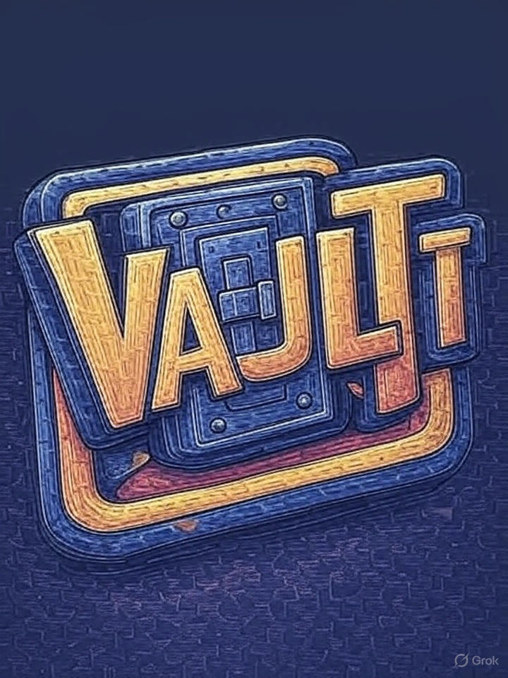

# 🎮 GameVault – Mini-Game Arcade! 🚀

> **Project Status:** Completed ✅<br>
> **This is a public repo for the project!**

Repository for our second semester college project — **GameVault**, a collection of mini‑games and puzzle games inspired by classic Flash game mechanics. This project is now fully completed and ready to play!

---

## 📝 Project Description

GameVault is designed to be a simple, engaging platform with multiple mini‑games. Each game focuses on logic, timing, and fun — just like the Flash games we grew up playing.

This project showcases our skills in programming, UI/UX, and teamwork during the second semester of our computer engineering course.

---

## 👨‍💻 Team Members

| NAME               | GITHUB USERNAME  |
|--------------------|------------------|
| Mahesh Panta       | maheshpanta333   |
| Ruyoj KC           | joyur98          |
| Abhyudaya Pokhrel  | abhyudaya        |
| Sworup Jangam      | UltimateDH       |

---

## 📌 Project Goals

- Develop multiple playable mini‑games  
- Implement game logic and interactive UI  
- Learn team collaboration using Git and GitHub  
- Polish and deliver a presentable final product  

---

## ✅ Tech Stack

| Layer           | Technology  | Purpose                                           |
|-----------------|-------------|---------------------------------------------------|
| 🎮 Game Engine  | Raylib      | Lightweight C library for graphics & input        |
| 🖱️ GUI          | RayGUI      | Immediate‑mode UI toolkit for in‑game menus       |
| 🌐 Networking   | ENet        | Reliable UDP networking for real‑time multiplayer |
| 🧠 Logic         | C++17       | Core game logic, physics, state handling         |
| 🗃️ Build System | CMake       | Cross‑platform build configuration                |
| 🧪 Debug Tools   | std::cout & custom logs | Logging and debugging game/network state |

---

## 📦 Dependencies

- Raylib  
- RayGUI  
- ENet  

You can install them via package managers like vcpkg, Homebrew, or build from source.

---

## ⚙️ Build Instructions

```bash
# Clone the repo
git clone https://github.com/maheshpanta333/GameVault.git
cd GameVault

# Create a build directory and run CMake
mkdir build && cd build
cmake ..

# Build all targets (games + server)
cmake --build . --config Release
```
## ▶️ Running the EnetPong Multiplayer Game

The **EnetPong** multiplayer mini-game uses a client–server model. To play locally or over LAN, follow these steps:

```bash
# Start the server (executable: mossserver)
./mossserver    # listens on default port 1234
```
and then launch NetPong from your launcher!
If the game ends then wait for certain for the server to reset before joining again!
<br>
## Thank you for reviewing our project!!
